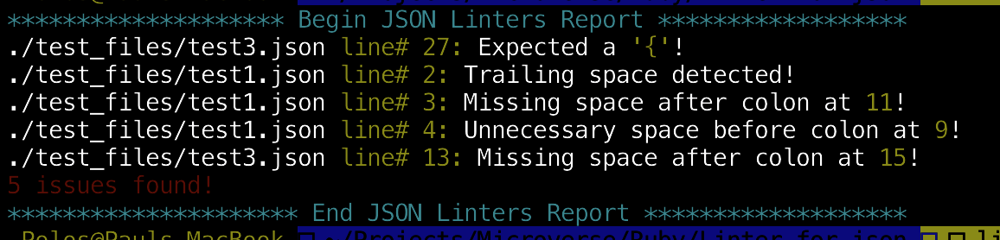

# Project Name

> This is a capstone project done at the end of the Ruby section of the Microverse technical curriculum.

This project is a linter for JSON files. It is able to search for all `.json` files in the project folder and run the following linters on them:
- Check for line trailing space
- Check for sorrounding space for colon
- Check that all opening curly braces have closing counterparts
- Check that all opening square brackets have closing counterparts

## Built With

- Ruby,
- Rspec

## Getting Started

To get a local copy up and running follow these simple example steps.

### Prerequisites

- Ruby 2.7.x

### Setup

Clone this repository by running `git clone https://github.com/pbkabali/Linter-for-json.git`

### Install

Navigate to the root directory

### Usage

- put JSON files for linting anywhere in the project dorectory. I recommend inside the `test_files` directory or a new directory in the root folder

- Run `ruby ./bin/main.rb` from within the root directory
- The program will scan for all `.json` files in the root plus all sub-directories and display a result log in the console.

### Run tests

Run `rspec` from the root directory to run all test files

## Author

👤 **Paul Balitema Kabali**

- Github: [@pbkabali](https://github.com/pbkabali)
- Twitter: [@pbkabali](https://twitter.com/pbkabali)
- Linkedin: [engineerbpk](https://linkedin.com/in/engineerbpk)

## 🤝 Contributing

Contributions, issues and feature requests are welcome!

Feel free to check the [issues page](https://github.com/pbkabali/Linter-for-json/issues).

## Show your support

Give a ⭐️ if you like this project!

## Acknowledgments

- Microverse Team 140 - The Cupids

## 📝 License

This project is [MIT](https://opensource.org/licenses/MIT) licensed.
