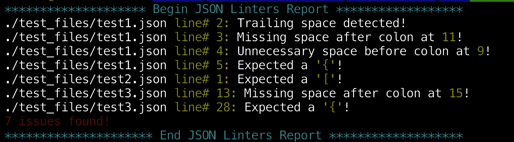
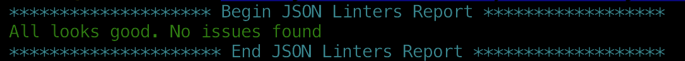

# Linter for JSON

> This is a capstone project done at the end of the Ruby section of the Microverse technical curriculum.

This project is a linter for JSON files. It is able to search for all `.json` files in the project folder and run the following linters on them:
- Check for line trailing space
- Check for surrounding space for colon
- Check that all opening curly braces have closing counterparts
- Check that all opening square brackets have closing counterparts

## Demo

Watch demo video [here](https://www.loom.com/share/893c94f7f33444adb8903fe800efc9e1)

## Built With

- Ruby,
- Rspec

## Getting Started

To get a local copy up and running follow these simple steps.

### Prerequisites

- Ruby 2.7.x

### Setup

- Clone this repository by running `git clone https://github.com/pbkabali/Linter-for-json.git`
- Navigate to the root directory

### Install

The Ruby programming language needed for this project can be downloaded and installed from the official site [here](https://www.ruby-lang.org/en/downloads/)

If you need to run tests, you need the Rspec gem. A step-by-step guide on installing Rspec can be found [here](https://www.tutorialspoint.com/rspec/rspec_introduction.htm#:~:text=In%20order%20to%20install%20a,to%20use%20the%20gem%20command.&text=Do%20not%20worry%2C%20if%20your,to%20install%20the%20rspec%20gem.)

### Usage

- put JSON files for linting anywhere in the project directory. I recommend inside the `test_files` directory or a new directory in the root folder

- Run `ruby ./bin/main.rb` from within the root directory
- The program will scan for all `.json` files in the root plus all sub-directories and display a result log in the console.
- If errors are found in any of the files, the result log will include the file name and relative path and the error details as in the example below:

- If no errors are found, the result will be displayed as below

### Run tests

Run `rspec` from the root directory to run all test files

## Author

👤 **Paul Balitema Kabali**

- Github: [@pbkabali](https://github.com/pbkabali)
- Twitter: [@pbkabali](https://twitter.com/pbkabali)
- Linkedin: [engineerbpk](https://linkedin.com/in/engineerbpk)

## 🤝 Contributing

Contributions, issues and feature requests are welcome!

Feel free to check the [issues page](https://github.com/pbkabali/Linter-for-json/issues).

## Show your support

Give a ⭐️ if you like this project!

## Acknowledgments

- Microverse Team 140 - The Cupids

## 📝 License

This project is [MIT](https://opensource.org/licenses/MIT) licensed
